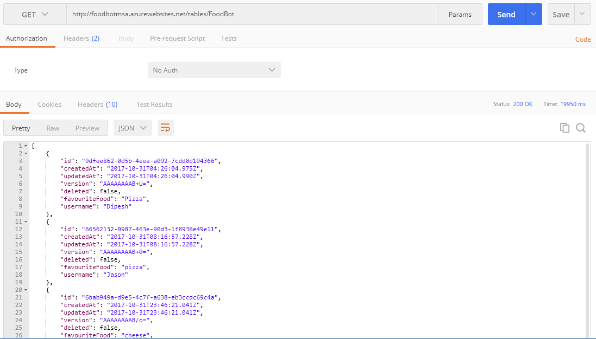
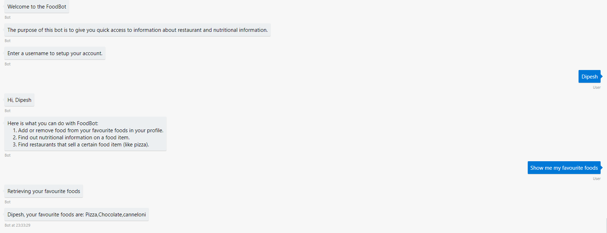

# 2.3 Integrating Easy Tables with Node.js (GET Request) 

## 2.3.1 Introduction

- We've now got a database up and running with some content inside of it, we now want to interact with the Database so that we can retrieve persisted user data.

- When you query EasyTables, you are returned the complete dataset of every single instance inside your database, and so firstly
we'll complete a get request from postman to the EasyTables, and then have a look at how the data is stored.



So you can see, that the data is all there and every single property you want is there, this includes the username and FavouriteFood, the things that we care about.


## 2.3.1 Creating REST Call

Head over to the RestClient.js File

We now want to integrate this inside our application and so we will start off by the function to send the get request.
We want to export the function so that you can use it outside of the script file and it can be reffered to by the other files

The parameters of the functions will be, the URL You want to connect to, the SESSION you are currently in, the USERNAME you want to find and the callback function, which will process the value that has been returned.

Here we see, if there is an error then we log it to the console to see what's happening, otherwise we pass it on to our callback.
```javascript
exports.getFavouriteFood = function getData(url, session, username, callback){
    request.get(url, {'headers':{'ZUMO-API-VERSION': '2.0.0'}}, function(err,res,body){
        if(err){
            console.log(err);
        }else {
            callback(body, session, username);
        }
    });
};
```

## 2.3.2 Handling calls and responses to the REST API
Create a file called FavouriteFoods.js file inside the controller folder, and this is where we will store all of our intermediary functions that link LUIS to our database.

Over here, we want to create an intermediary function that will call the function that will retrieve food for us, this is done as a best practice, as we want modifiability in our code, it provides a seperations of concerns between where we are processing our LUIS code, and our code that is used to calll EasyTables, this makes maintenance of code and debugging a lot easier than if we directly called our function from the LuisDialog file.

```Javascript
var rest = require('../API/Restclient');

exports.displayFavouriteFood = function getFavouriteFood(session, username){
    var url = 'https://foodbotmsa.azurewebsites.net/tables/FoodBot';
    rest.getFavouriteFood(url, session, username, handleFavouriteFoodResponse)
};

```
What this does is, it calls the getFavouriteFood function, that we will edit below to display our favourite food with a callback function.

And here we have our get request, we now want our callback function to process the resulting data that we have so that we can process the bulk data received and make some sense of it.

## 2.3.2 (Cont) Handling the response to the function
Bare with me here, as it might get a little confusing we have a few methods that we use to handle the processing.

```javascript
function handleFavouriteFoodResponse(message, session, username) {
    var favouriteFoodResponse = JSON.parse(message);
    var allFoods = [];
    for (var index in favouriteFoodResponse) {
        var usernameReceived = favouriteFoodResponse[index].username;
        var favouriteFood = favouriteFoodResponse[index].favouriteFood;

        //Convert to lower case whilst doing comparison to ensure the user can type whatever they like
        if (username.toLowerCase() === usernameReceived.toLowerCase()) {
            //Add a comma after all favourite foods unless last one
            if(favouriteFoodResponse.length - 1) {
                allFoods.push(favouriteFood);
            }
            else {
                allFoods.push(favouriteFood + ', ');
            }
        }        
    }
    
    // Print all favourite foods for the user that is currently logged in
    session.send("%s, your favourite foods are: %s", username, allFoods);                
    
}
```
Here we have the function that will handle the response to our favourite food, what it does is it gets all of the foods and the users associated with it, iterates through the array that the users and foods are all stored in, and it checks to see if the users name matches all of their favourite foods, and then it returns all of the users favourite foods.


## 2.3.3 Adding the call inside LUIS

```javascript
   bot.dialog('GetFavouriteFood', [
        function (session, args, next) {
            session.dialogData.args = args || {};        
            if (!session.conversationData["username"]) {
                builder.Prompts.text(session, "Enter a username to setup your account.");                
            } else {
                next(); // Skip if we already have this info.
            }
        },
        function (session, results, next) {
            if (!isAttachment(session)) {

                if (results.response) {
                    session.conversationData["username"] = results.response;
                }

                session.send("Retrieving your favourite foods");
                food.displayFavouriteFood(session, session.conversationData["username"]);  // <---- THIS LINE HERE IS WHAT WE NEED 
            }
        }
    ]).triggerAction({
        matches: 'GetFavouriteFood'
    });
```
All this does is checks thesession to see if you are logged in,and if you are not it prompts you, otherwise you are able  to get your favourite foods.


Great! Now we're all done, and it should look like this



